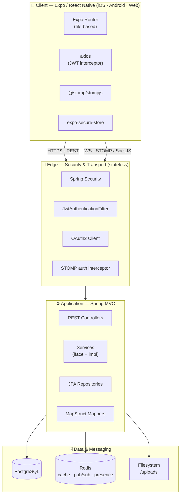
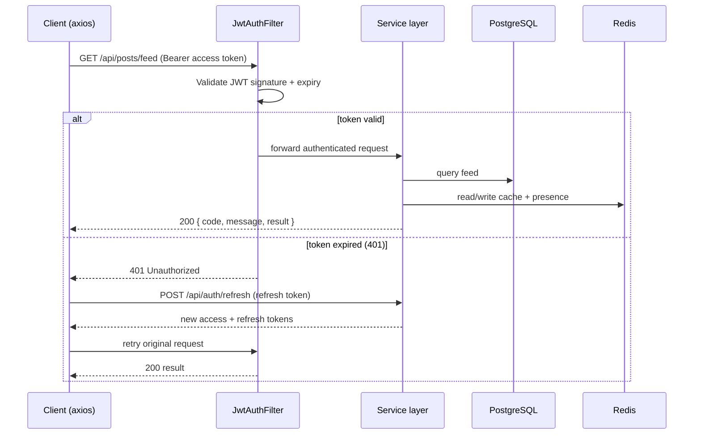
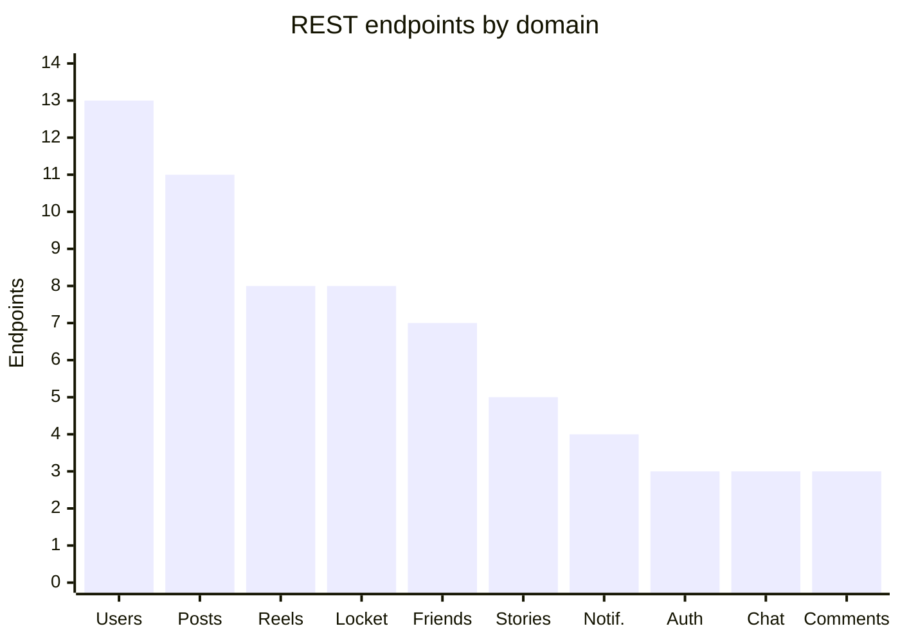
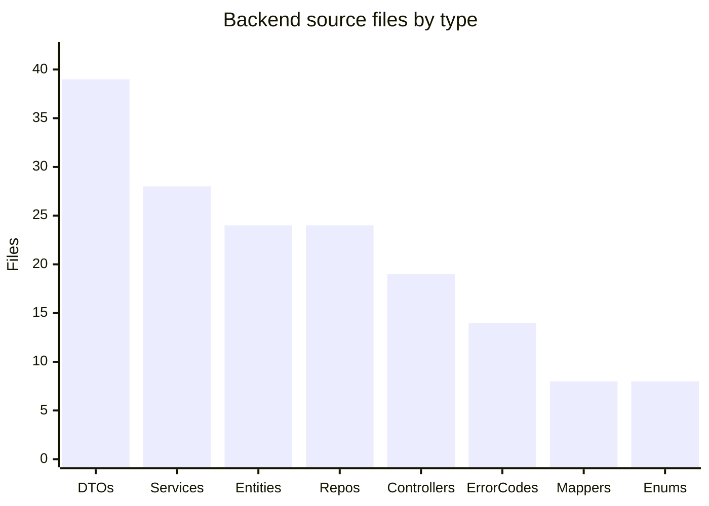

# VibeNet — Technical Stack Report

**Project:** VibeNet — a social networking / media-sharing mobile application (feed, stories, reels, direct messaging, and a "Locket"-style close-friends moment sharing feature).

**Repository layout:**

| Folder | Role | Technology |
|--------|------|-----------|
| `backend/` | REST + WebSocket API server | Java 21 · Spring Boot 4.1.0 |
| `vibenet/` | Cross-platform mobile/web client | Expo SDK 56 · React Native 0.85 · TypeScript |

> Note: an older `frontend/` folder has been retired; `vibenet/` is the canonical client.

> 📊 An interactive visual version of this report (styled diagrams, entity cards, and charts) is available in `docs/vibenet-architecture.html`.

---

## 0. System Architecture



The client talks HTTP + WebSocket to a **stateless** Spring Boot server that persists to **PostgreSQL** and uses **Redis** for cache, presence, and notification fan-out.

---

## 1. Backend

### 1.1 Platform & Language
- **Language:** Java 21
- **Framework:** Spring Boot **4.1.0** (parent: `spring-boot-starter-parent`)
- **Build tool:** Maven (with bundled Maven Wrapper `mvnw` / `mvnw.cmd`)
- **Group / Artifact:** `vibe.net` / `backend` (`0.0.1-SNAPSHOT`)

### 1.2 Core Frameworks & Starters
| Dependency | Purpose |
|-----------|---------|
| `spring-boot-starter-webmvc` | REST controllers (Spring MVC) |
| `spring-boot-starter-data-jpa` | ORM / persistence (Hibernate) |
| `spring-boot-starter-data-redis` | Redis caching & pub/sub (Lettuce client) |
| `spring-boot-starter-security` | Authentication & authorization |
| `spring-boot-starter-security-oauth2-client` | OAuth2 client login support |
| `spring-boot-starter-validation` | Bean validation (Jakarta Validation) |
| `spring-boot-starter-websocket` | Real-time messaging (STOMP over WebSocket) |

### 1.3 Persistence & Data
- **Primary database:** PostgreSQL (`org.postgresql:postgresql`, runtime)
- **ORM:** Spring Data JPA / Hibernate — `ddl-auto: update`, SQL logging enabled
- **Cache / messaging:** Redis (Lettuce, 2s timeouts, DB fallback on failure) — used for notifications and moment read paths
- **Datasource / Redis config:** externalized via `.env` (imported by `application.yaml`)

### 1.4 Security & Auth
- **JWT** authentication via `io.jsonwebtoken:jjwt` **0.12.7** (`jjwt-api`, `jjwt-impl`, `jjwt-jackson`)
  - Custom `JwtAuthenticationFilter`, `JwtServiceImpl`; configurable issuer / audience / expiration
  - Stateless sessions (`SessionCreationPolicy.STATELESS`), CSRF disabled, CORS configurable
  - Public routes: `/api/auth/**`, `/uploads/**`, `/ws/**`, Swagger, `/error`; all others authenticated
  - Custom `RestAuthEntryPoint` and `RestAccessDeniedHandler` for JSON error responses
- **OAuth2 client** starter present for social login
- **Admin seeding:** `AdminSeeder` bootstraps an admin account from env vars

### 1.5 Real-time (WebSocket)
- **STOMP** messaging over WebSocket with **SockJS** fallback
  - Endpoint: `/ws` (SockJS, all origins allowed)
  - App prefix `/app`; simple broker on `/topic`, `/queue`; user prefix `/user`
  - `StompAuthChannelInterceptor` authenticates STOMP frames via JWT
  - Chat message/typing/read events via `@MessageMapping` (`/app/chat.send`, `.typing`, `.read`)

### 1.6 Supporting Libraries
| Library | Version | Purpose |
|---------|---------|---------|
| **Lombok** | (managed) | Boilerplate reduction (getters/builders) |
| **MapStruct** | 1.6.3 | DTO ↔ entity mapping (with `lombok-mapstruct-binding` 0.2.0) |
| **SpringDoc OpenAPI** | 2.8.9 | Swagger UI / OpenAPI docs at `/swagger` |
| **JCodec** | 0.2.5 | Video duration probing for Locket moments |

### 1.7 Testing
Spring Boot test starters for JPA, Security, OAuth2 client, Validation, WebMVC, and WebSocket.

### 1.8 File Storage
- Local filesystem storage (`FileServiceImpl`) — configurable upload dir (`FILE_UPLOAD_DIR`)
- Multipart uploads up to **500 MB** (posts, reels, stories, moments, avatars)
- Uploaded media served from `/uploads/**`

### 1.9 Architecture
Layered architecture: `controllers → services (interface + impl) → repositories (JPA) → entities`, with `mappers` (MapStruct), `dtos` (request/response), `enums`, and a structured `exception` package (domain-specific `ErrorCode` classes + `GlobalExceptionHandler`). Notifications use an event/publisher/listener pattern over Redis.

---

## 2. Backend REST API Surface

Base path: `/api`. Standard envelope: `ApiResponse { code, message, result }`.

| Controller | Base Route | Key Endpoints |
|-----------|-----------|---------------|
| **Auth** | `/api/auth` | `POST /register`, `POST /login`, `POST /refresh` |
| **User** | `/api/users` | list, `/{id}`, `/search`, `/{id}/visitors`, `/online`, `POST /heartbeat`, `PUT /change-password`, `DELETE /me`, follow/unfollow, followers/following |
| **Profile** | `/api/profile` | create / update profile (multipart) |
| **Post** | `/api/posts` | CRUD, `/feed`, `/user/{id}`, save, saved, liked, share |
| **Comment** | `/api/posts/{postId}/comments` | create, list, delete |
| **Comment Reaction** | `/api/posts/comments/{id}/reactions` | react to comment |
| **Reaction** | `/api/posts/{postId}/reactions` | react to post |
| **Reel** | `/api/reels` | create, `/feed`, `/{id}`, `/user/{id}`, view, save, share, delete |
| **Reel Comment** | `/api/reels/{reelId}/comments` | create, list, delete |
| **Reel Reaction** | `/api/reels/{reelId}/reactions` | react to reel |
| **Story** | `/api/stories` | create, `/feed`, `/user/{id}`, view, delete |
| **Explore** | `/api/explore` | `/grid` (discovery feed) |
| **Friendship** | `/api/friends` | request, accept, decline, remove, status, incoming requests |
| **Locket – Close Friends** | `/api/locket/close-friends` | list, add, remove |
| **Locket – Moments** | `/api/locket/moments` | create (multipart), latest, feed, sent, unread-count, view, viewers, react |
| **Chat** | `/api/chat` | rooms, room messages, friend room |
| **Chat WebSocket** | `/app/chat.*` | send, typing, read (STOMP) |
| **Notification** | `/api/notifications` | list, unread-count, mark read, mark all read |
| **Device** | `/api/devices` | register / delete push token |

**Domain enums:** `FriendStatus`, `Gender`, `MediaType`, `NotificationType`, `Platform`, `ReactionType`, `Role`, `Status`.

---

## 2A. Data Model (Entity Relationship Diagram)

24 JPA entities keyed by `UUID`. `User` is the hub; content (posts, reels, stories, moments) and the social graph radiate from it. Join/activity tables (views, saves, reactions, recipients) are shown condensed.

```mermaid
erDiagram
    USER ||--o| PROFILE : has
    USER ||--o{ POST : owns
    USER ||--o{ REEL : creates
    USER ||--o{ STORY : posts
    USER ||--o{ FRIENDSHIP : "sends / receives"
    USER ||--o{ FOLLOW : follows
    USER ||--o{ CLOSE_FRIEND : curates
    USER ||--o{ LOCKET_MOMENT : sends
    USER ||--o{ CHAT_MESSAGE : "sends / receives"
    USER ||--o{ NOTIFICATION : "recipient / actor"
    USER ||--o{ DEVICE_TOKEN : registers

    POST ||--o{ COMMENT : has
    POST ||--o{ REACTION : has
    POST ||--o{ SAVED_POST : "saved in"
    COMMENT ||--o{ COMMENT : "replies to"
    COMMENT ||--o{ COMMENT_REACTION : has

    REEL ||--o{ REEL_COMMENT : has
    REEL ||--o{ REEL_REACTION : has
    REEL ||--o{ SAVED_REEL : "saved in"

    STORY ||--o{ STORY_VIEW : "viewed via"

    LOCKET_MOMENT ||--o{ LOCKET_MOMENT_RECIPIENT : "delivered to"
    LOCKET_MOMENT ||--o{ LOCKET_REACTION : receives

    USER {
        UUID id PK
        string username UK
        string email UK
        string hashedPassword
        Role role
        Status status
        datetime lastActiveAt
    }
    PROFILE {
        UUID id PK_FK
        string fullName
        string avatarUrl
        string bio
        Gender gender
        date dateOfBirth
    }
    POST {
        UUID id PK
        string textContent
        list mediaUrl
        long sharesCount
        datetime createdAt
    }
    REEL {
        UUID id PK
        string videoUrl
        int durationSeconds
        long viewsCount
    }
    STORY {
        UUID id PK
        string mediaUrl
        MediaType mediaType
        datetime expiresAt
    }
    LOCKET_MOMENT {
        UUID id PK
        string mediaUrl
        MediaType mediaType
        string caption
    }
    FRIENDSHIP {
        UUID id PK
        FriendStatus status
        datetime createdAt
    }
    NOTIFICATION {
        UUID id PK
        NotificationType type
        boolean isRead
        UUID relatedEntityId
    }
    CHAT_MESSAGE {
        UUID id PK
        string chatId
        string content
    }
```

**Notes:** `Profile` shares `User`'s primary key (`@MapsId` one-to-one). `Follow`, `Friendship`, `CloseFriend`, and `ChatMessage` are self-referential across users. Uniqueness constraints are enforced on join tables (one view/save/follow per user pair).

### Entity catalog by domain (24 entities)

| Domain | Entities |
|--------|----------|
| **Identity & Social Graph** | `User`, `Profile`, `Follow`, `Friendship`, `ProfileVisit` |
| **Feed & Posts** | `Post`, `Comment`, `Reaction`, `CommentReaction`, `SavedPost` |
| **Reels & Stories** | `Reel`, `ReelComment`, `ReelReaction`, `SavedReel`, `Story`, `StoryView` |
| **Locket Moments** | `CloseFriend`, `LocketMoment`, `LocketMomentRecipient`, `LocketReaction` |
| **Messaging & Notifications** | `ChatRoom`, `ChatMessage`, `Notification`, `DeviceToken` |

---

## 2B. Authentication & Request Flow

Stateless JWT with transparent refresh — the axios client retries once on `401` after silently exchanging the refresh token.



---

## 3. Frontend (Mobile / Web Client)

### 3.1 Platform & Language
- **Framework:** Expo **SDK 56** with **React Native 0.85.3**
- **React:** 19.2.3 (+ `react-dom` 19.2.3 for web)
- **Language:** TypeScript ~6.0.3
- **Routing:** **Expo Router** ~56.2.18 (file-based routing, typed routes enabled)
- **Compiler:** React Compiler enabled (`experiments.reactCompiler`)
- **Targets:** iOS, Android, and Web (`react-native-web` ~0.21, static web output)

### 3.2 Networking & Real-time
| Library | Version | Purpose |
|---------|---------|---------|
| **axios** | ^1.19.0 | HTTP client (with JWT interceptors + auto token refresh) |
| **@stomp/stompjs** | ^7.3.0 | STOMP over WebSocket for chat/real-time |
| **expo-secure-store** | ^57.0.1 | Secure token storage (falls back to `localStorage` on web) |

- API base URL resolves per-platform (`10.0.2.2` for Android emulator, `localhost` otherwise), overridable via `EXPO_PUBLIC_API_URL`
- Axios client auto-attaches Bearer token, transparently refreshes on 401, and routes to login on auth expiry

### 3.3 UI, Animation & Media
| Library | Purpose |
|---------|---------|
| `@expo/ui` | Native UI primitives |
| `@expo/vector-icons` | Icon set |
| `@gorhom/bottom-sheet` | Bottom-sheet modals (comments, options) |
| `expo-blur`, `expo-glass-effect`, `expo-linear-gradient` | Glassmorphic UI effects |
| `react-native-reanimated` (4.3.1) + `react-native-worklets` | Animations |
| `react-native-gesture-handler` | Gestures |
| `lottie-react-native` | Lottie animations |
| `react-native-svg` | Vector graphics |
| `expo-image`, `expo-video` | Optimized image / video playback |
| `expo-image-picker` | Media capture / selection |
| `expo-haptics` | Haptic feedback |
| `expo-symbols` | SF Symbols |
| `react-native-safe-area-context`, `react-native-screens` | Navigation primitives |
| `expo-font`, `expo-splash-screen`, `expo-status-bar`, `expo-system-ui` | App chrome / theming |
| `expo-linking`, `expo-web-browser`, `expo-constants`, `expo-device` | Platform integration |

### 3.4 App Structure
- **Screens (`src/app/`):** tab navigation (`index` feed, `explore`, `locket`, `messages`, `notifications`, `profile`), plus `auth/` (login, register), `chat/[id]`, `profile/[id]`, `stories/[id]`
- **Components:** feature-grouped — `feed/`, `reels/`, `stories/`, `locket/`, `profile/`, `navigation/`, `skeletons/` (loading states), `ui/` (glassmorphic design system: `GlassCard`, `GlassInput`, `PrimaryButton`, etc.)
- **Services (`src/services/`):** typed API modules per domain (`auth`, `posts`, `reels`, `stories`, `chat`, `comments`, `reactions`, `friends`, `locket`, `notifications`, `users`, `explore`), plus `client.ts` (axios), `websocket.ts` (STOMP), `storage.ts`, `config.ts`
- **State:** React Context (`AuthContext`) + hooks; theming via `use-color-scheme` / `use-theme`
- **Custom Expo config plugin:** `plugins/withHighRefreshRate.js` (enables high refresh-rate rendering)

### 3.5 Tooling
- **ESLint** ^9 with `eslint-config-expo` (`expo lint`)
- **TypeScript** ~6.0.3 (strict, typed routes via `expo-env.d.ts`)
- Scripts: `start`, `android`, `ios`, `web`, `lint`, `reset-project`

---

## 4. Environment & Configuration

### Backend (`.env`)
`DB_URL`, `DB_USERNAME`, `DB_PASSWORD` · `REDIS_HOST`, `REDIS_PORT` · `JWT_SECRET_KEY`, `JWT_ISSUER`, `JWT_AUDIENCE`, `JWT_EXPIRATION_IN_MS` · `FILE_UPLOAD_DIR` · `CORS_ALLOWED_ORIGINS` · `ADMIN_USERNAME`, `ADMIN_EMAIL`, `ADMIN_PASSWORD`

### Frontend (`.env`)
`EXPO_PUBLIC_API_URL` (points client to the backend host)

---

## 4A. Codebase Metrics

**REST endpoints by domain** (≈ 80 endpoints across 19 controllers, plus 3 STOMP message mappings):



**Backend source composition:**



| Metric | Backend | Frontend |
|--------|--------:|---------:|
| Controllers / Screens | 19 | 14 |
| Services / API modules | 28 | 13 |
| Entities | 24 | — |
| Repositories | 24 | — |
| DTOs | 39 | — |
| Components | — | 40 |
| Runtime dependencies | ~15 | 30 |

> Counts derived from a static scan of `backend/src` (Java) and `vibenet/src` + `package.json`. Endpoint totals count distinct `@*Mapping` declarations. `xychart-beta` diagrams render on GitHub and other Mermaid 10+ viewers.

---

## 5. Technology Summary

| Layer | Technology |
|-------|-----------|
| **Mobile/Web client** | Expo SDK 56, React Native 0.85, React 19, TypeScript, Expo Router |
| **Client networking** | axios, @stomp/stompjs, expo-secure-store |
| **API server** | Java 21, Spring Boot 4.1, Spring MVC |
| **Persistence** | PostgreSQL + Spring Data JPA / Hibernate |
| **Cache / Pub-Sub** | Redis (Lettuce) |
| **Auth** | Spring Security, JWT (jjwt), OAuth2 client |
| **Real-time** | STOMP over WebSocket (+ SockJS) |
| **Mapping / Boilerplate** | MapStruct, Lombok |
| **API docs** | SpringDoc OpenAPI / Swagger UI |
| **Media** | Local file storage, JCodec (video probing) |
| **Build** | Maven (backend), npm / Expo CLI (frontend) |

---

*Generated from source scan of `backend/pom.xml`, `application.yaml`, controllers/configs, and `vibenet/package.json`, `app.json`, and service layer.*
