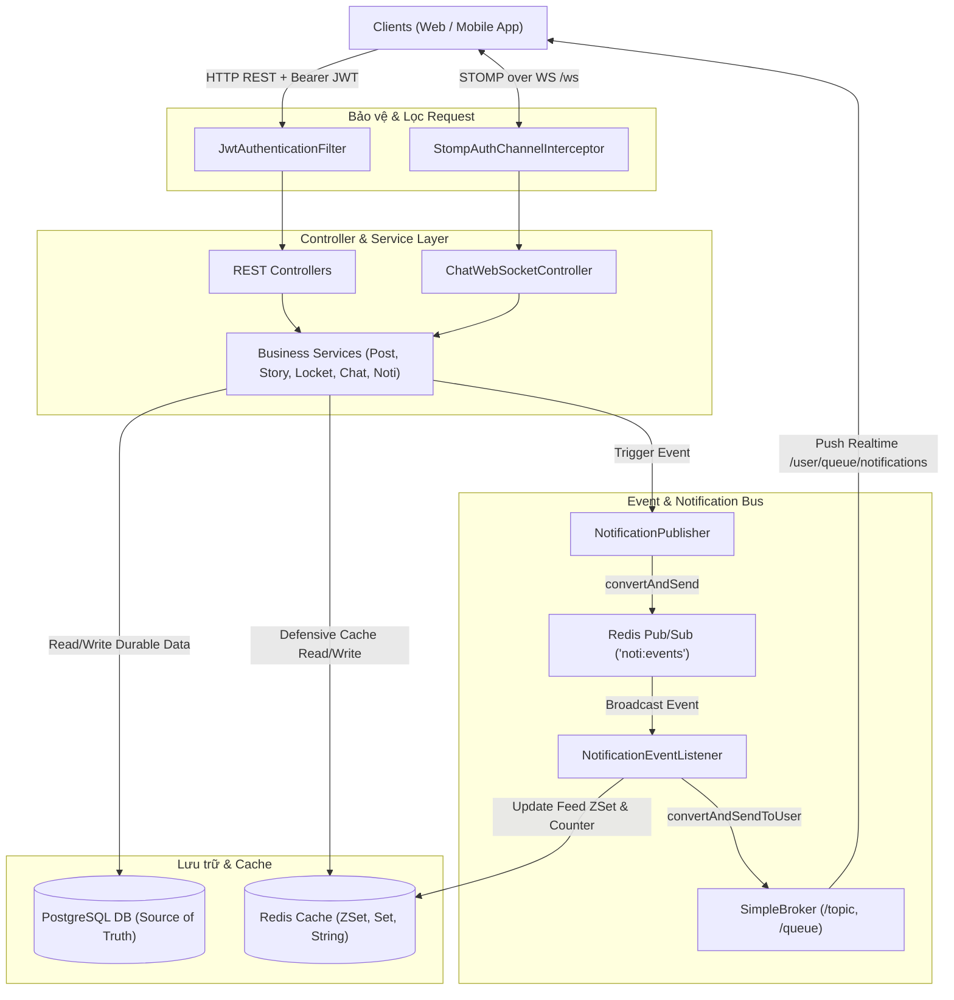

# TÀI LIỆU TOÀN TẬP KIẾN TRÚC & HỆ THỐNG BACKEND VIBENET

> **Phiên bản**: 1.0  
> **Công nghệ cốt lõi**: Java 21, Spring Boot 4.1.0, PostgreSQL, Redis, WebSocket STOMP, Spring Security, JJWT, MapStruct.  
> **Mục tiêu**: Cung cấp toàn bộ kiến thức, luồng hoạt động, cấu trúc mã nguồn và nguyên lý thiết kế của hệ thống Backend VibeNet.

---

## MỤC LỤC

1. [Tổng quan Kiến trúc Hệ thống](#1-tổng-quan-kiến-trúc-hệ-thống)
2. [Hệ thống Caching & Chi tiết Redis Keys](#2-hệ-thống-caching--chi-tiết-redis-keys)
3. [Luồng hoạt động Real-time Notifications](#3-luồng-hoạt-động-real-time-notifications)
4. [So sánh SSE (Server-Sent Events) vs WebSocket STOMP](#4-so-sánh-sse-vs-websocket-stomp)
5. [Hệ thống Chat Real-time: STOMP, Typing Indicator, Seen & Group Chat](#5-hệ-thống-chat-real-time-stomp-typing-indicator-seen--group-chat)
6. [Chi tiết toàn bộ lớp Cấu hình (Package `configs/`)](#6-chi-tiết-toàn-bộ-lớp-cấu-hình-package-configs)
7. [Bảng tra cứu toàn bộ Thư viện Backend (`pom.xml`)](#7-bảng-tra-cứu-toàn-bộ-thư-viện-backend-pomxml)

---

## 1. Tổng quan Kiến trúc Hệ thống

Backend VibeNet được xây dựng theo mô hình **Layered Clean Architecture** kết hợp với kiến trúc **Event-Driven & In-Memory Caching**:



---

## 2. Hệ thống Caching & Chi tiết Redis Keys

Tất cả các key và topic của Redis được định nghĩa tập trung trong class `vibe.net.backend.utils.RedisKeys`.

### 2.1 Bảng chi tiết toàn bộ Redis Keys

| Redis Key / Channel Pattern | Data Type | Mục đích sử dụng | Vòng đời & Thao tác chính |
| :--- | :--- | :--- | :--- |
| **`noti:events`** | Pub/Sub Channel | Kênh phát sóng (broadcast) sự kiện thông báo giữa các backend instance khi có tương tác mới. | `PUBLISH`: Khi có thông báo mới.<br>`SUBSCRIBE`: Đăng ký bởi `NotificationEventListener`. |
| **`user:noti:{userId}`** | Sorted Set (ZSet) | Bảng feed thông báo cá nhân, sắp xếp theo thời gian (`score = createdAt epoch millis`). Giới hạn top 100 thông báo gần nhất. | `ZADD`: Thêm thông báo mới.<br>`ZREMRANGEBYRANK`: Cắt tỉa giữ tối đa 100 phần tử gần nhất.<br>`ZREVRANGE`: Đọc feed phân trang O(log N + M). |
| **`user:unread_noti_count:{userId}`** | String (Counter) | Bộ đếm số lượng thông báo chưa đọc của người dùng. | `INCR`: Khi có thông báo mới.<br>`DECR`: Khi người dùng đọc 1 thông báo.<br>`SET 0`: Khi gọi `markAllRead`. |
| **`user:unread_moments:{userId}`** | Set | Tập hợp các `momentId` Locket chưa xem của user, phục vụ kiểm tra viền chuông vàng O(1). | `SADD`: Khi bạn bè gửi moment tới user.<br>`SREM`: Khi user mở xem moment (`viewMoment`).<br>`SCARD`: Lấy số lượng moment chưa đọc. |
| **`locket:latest:{userId}`** | String (JSON Object) | Cache DTO `LatestMomentResponse` mới nhất được gửi tới user để hiển thị widget/feed ngay lập tức mà không cần query SQL. | `SET`: Khi có moment mới gửi tới user.<br>`GET`: Lấy nhanh hiển thị widget. |
| **`locket:feed:{userId}`** | Key Prefix | Dự phòng cho việc mở rộng phân trang cache feed locket cá nhân. | Mở rộng tính năng phân phối feed. |

---

### 2.2 Triết lý `RedisSafe` (Graceful Degradation)

File `vibe.net.backend.utils.RedisSafe` thiết lập cơ chế bảo vệ phòng vệ (Defensive Caching):
1. **Ghi Cache (`RedisSafe.runQuietly`)**: Luôn thực hiện sau khi ghi PostgreSQL DB thành công. Nếu Redis gặp sự cố (mất kết nối, đầy RAM), exception sẽ được ghi log cảnh báo và **nuốt lại (swallow)** để **không bao giờ làm rollback giao dịch DB**.
2. **Đọc Cache (`RedisSafe.getQuietly`)**: Nếu Redis lỗi, trả về fallback (`null`), service tự động fallback truy vấn PostgreSQL DB và nạp lại cache khi Redis hoạt động bình thường.

---

## 3. Luồng hoạt động Real-time Notifications

### Quy trình từng bước khi phát sinh thông báo:

```mermaid
sequenceDiagram
    autonumber
    actor Actor as User A (Người tương tác)
    participant Svc as Business Service
    participant Pub as NotificationPublisher
    participant DB as PostgreSQL
    participant Redis as Redis (Pub/Sub & ZSet)
    participant Sub as NotificationEventListener
    participant Broker as STOMP SimpMessagingTemplate
    actor Recipient as User B (Người nhận)

    Actor->>Svc: Thả tim / Comment / Gửi Locket Moment
    Svc->>Pub: publish(recipientId, actorId, type, relatedEntityId)
    Pub->>DB: Lưu Notification Entity (Durable Record)
    Pub->>Redis: convertAndSend("noti:events", NotificationEvent)
    Redis-->>Sub: onMessage(NotificationEvent)
    Sub->>Redis: ZADD "user:noti:{recipientId}" (score = epochMilli)
    Sub->>Redis: ZREMRANGEBYRANK (Giữ top 100)
    Sub->>Redis: INCR "user:unread_noti_count:{recipientId}"
    Sub->>Broker: convertAndSendToUser(recipientId, "/queue/notifications", event)
    Broker-->>Recipient: STOMP Frame Real-time Push
```

---

## 4. So sánh SSE vs WebSocket STOMP

| Tiêu chí | SSE (Server-Sent Events) | STOMP qua WebSocket (Hiện tại) |
| :--- | :--- | :--- |
| **Giao thức** | HTTP đơn hướng (`text/event-stream`), Server $\to$ Client. | TCP 2 chiều (Full-duplex), frame STOMP qua WebSocket (`/ws`). |
| **Phạm vi sử dụng** | Phù hợp cho kênh chỉ nhận (Chỉ thông báo, streaming bài viết). | Phục vụ cả 2 chiều: Chat 1-1, Typing indicator, Read receipts, và Real-time Notifications. |
| **Tối ưu kết nối trên Mobile** | Phải duy trì 2 kết nối (1 SSE cho Noti + 1 Socket cho Chat). | **1 kết nối duy nhất (`/ws`)**: Tiết kiệm pin, RAM, và số lượng socket mở trên mobile. |
| **Xác thực** | Query param hoặc Header lúc mở kết nối. | Xác thực JWT ngay tại frame STOMP `CONNECT` qua `StompAuthChannelInterceptor`. |

---

## 5. Hệ thống Chat Real-time: STOMP, Typing Indicator, Seen & Group Chat

### 5.1 Cấu hình STOMP Endpoints
Định nghĩa trong `WebSocketConfig.java`:
* Endpoint kết nối: `/ws` (kèm SockJS fallback).
* Prefix gửi từ client: `/app` (đi vào `@MessageMapping`).
* Prefix broker phân phối: `/topic` (broadcast) và `/queue` (point-to-point).
* User destination prefix: `/user`.

### 5.2 Luồng gửi tin nhắn Chat
1. **Qua WebSocket (`/app/chat.send`)**:
   * Client gửi payload `{ "recipientId": "...", "content": "..." }`.
   * Server lưu tin nhắn vào PostgreSQL qua `chatService.saveMessage(...)`.
   * Đẩy tin nhắn tới người nhận: `messagingTemplate.convertAndSendToUser(recipientId, "/queue/messages", saved)`.
   * Đẩy tin nhắn về người gửi (đồng bộ đa thiết bị): `messagingTemplate.convertAndSendToUser(senderId, "/queue/messages", saved)`.
2. **Qua REST API (`POST /api/chat/{friendId}/messages`)**:
   * Lưu DB xong vẫn đẩy qua STOMP tới cả 2 người. Giúp gửi tin thành công ngay cả khi socket đang reconnect.

### 5.3 Typing Indicator & Seen Receipt (Đang soạn tin & Đã xem)
* **Typing Indicator**:
  * Client gửi lên: `/app/chat.typing` kèm `{ "chatId": "...", "isTyping": true/false }`.
  * Server broadcast tới: `/topic/chat/{chatId}/typing`.
* **Seen Receipt**:
  * Client gửi lên: `/app/chat.read` kèm `{ "chatId": "...", "lastMessageId": "..." }`.
  * Server broadcast tới: `/topic/chat/{chatId}/read`.
* *Lưu ý*: Cả 2 sự kiện là dạng **Ephemeral Event** (thời gian thực, không lưu DB).

### 5.4 Định hướng kiến trúc Chat Nhóm (Group Chat)
Để mở rộng sang chat nhóm:
1. **DB**: Bổ sung bảng `ChatGroup` và `GroupMember`.
2. **REST API**: Tạo nhóm `POST /api/chat/groups`, quản lý thành viên `POST/DELETE /api/chat/groups/{groupId}/members`.
3. **STOMP Destination**:
   * Gửi tin nhóm: `/app/group.send` với `{ "groupId": "...", "content": "..." }`.
   * Server broadcast tới: `/topic/groups/{groupId}`.
   * Các thành viên trong nhóm chỉ cần subscribe `/topic/groups/{groupId}` để nhận tin.

---

## 6. Chi tiết toàn bộ lớp Cấu hình (Package `configs/`)

### 1. `SecurityConfig.java`
* Thiết lập bộ lọc bảo mật `SecurityFilterChain` theo cơ chế **Stateless REST API** (`SessionCreationPolicy.STATELESS`).
* Tắt CSRF, cấu hình CORS theo biến môi trường `app.cors.allowed-origins`.
* Whitelist các URL công khai: `/api/auth/**`, `/v3/api-docs/**`, `/swagger-ui/**`, `/uploads/**`, `/ws/**`.
* Kích hoạt `@EnableMethodSecurity` cho phép dùng `@PreAuthorize("hasRole('ADMIN')")`.
* Đăng ký Bean `PasswordEncoder` sử dụng BCrypt độ mạnh 12.

### 2. `RestAuthEntryPoint.java`
* Xử lý lỗi **401 Unauthorized** khi client chưa xác thực hoặc token hết hạn. Trả về JSON chuẩn `ApiResponse` với mã lỗi `UNAUTHENTICATED`.

### 3. `RestAccessDeniedHandler.java`
* Xử lý lỗi **403 Forbidden** khi client đã đăng nhập nhưng không đủ quyền truy cập tài nguyên. Trả về JSON chuẩn với mã lỗi `ACCESS_DENIED`.

### 4. `WebSocketConfig.java`
* Kích hoạt WebSocket Message Broker (`@EnableWebSocketMessageBroker`), mở endpoint `/ws`, cấu hình `/app`, `/topic`, `/queue`, `/user` và gắn `StompAuthChannelInterceptor`.

### 5. `StompAuthChannelInterceptor.java`
* Chặn frame STOMP `CONNECT` trên Inbound Channel, trích xuất Bearer JWT từ header `Authorization` hoặc `token`, giải mã `userId`, `role` và gán vào `accessor.setUser(authToken)`.

### 6. `RedisConfig.java`
* Cung cấp Bean `RedisTemplate<String, Object>` dùng `GenericJacksonJsonRedisSerializer` hỗ trợ serialize các object phức tạp (như `LocalDateTime`, DTO, Record) mà không mất kiểu dữ liệu. Cung cấp Bean `StringRedisTemplate` và `RedisMessageListenerContainer`.

### 7. `NotificationRedisListenerConfig.java`
* Tạo Bean `ChannelTopic("noti:events")` và đăng ký `NotificationEventListener` vào `RedisMessageListenerContainer`.

### 8. `WebConfig.java`
* Triển khai `WebMvcConfigurer`: Phục vụ file tĩnh từ ổ cứng qua đường dẫn `/uploads/**` và cấu hình CORS ở tầng MVC.

### 9. `OpenAPIConfig.java`
* Cấu hình tài liệu Swagger UI (OpenAPI 3.0) kèm cấu hình `bearerAuth` giúp tester dán JWT Token trực tiếp trên `/swagger-ui.html`.

### 10. `AdminSeeder.java`
* Triển khai `ApplicationRunner`: Tự động khởi tạo tài khoản quản trị viên (`Role.ADMIN`) khi hệ thống khởi động lần đầu nếu cấu hình `ADMIN_PASSWORD` được cung cấp.

---

## 7. Bảng tra cứu toàn bộ Thư viện Backend (`pom.xml`)

| Tên Thư viện | Phiên bản | Nhóm chức năng & Công dụng chi tiết |
| :--- | :--- | :--- |
| **`spring-boot-starter-webmvc`** | 4.1.0 | Xây dựng RESTful API, Controller, xử lý HTTP request/response và tải file tĩnh. |
| **`spring-boot-starter-data-jpa`** | 4.1.0 | Tích hợp Hibernate ORM, quản lý Entities và Repositories tương tác với cơ sở dữ liệu. |
| **`spring-boot-starter-data-redis`** | 4.1.0 | Cung cấp RedisTemplate và Pub/Sub listener container phục vụ Caching và phân phối sự kiện. |
| **`spring-boot-starter-websocket`** | 4.1.0 | Khởi tạo kết nối WebSocket và STOMP Message Broker phục vụ giao tiếp 2 chiều thời gian thực. |
| **`spring-boot-starter-security`** | 4.1.0 | Quản lý xác thực, phân quyền, lọc request HTTP và mã hóa mật khẩu an toàn. |
| **`spring-boot-starter-validation`** | 4.1.0 | Validate dữ liệu đầu vào của DTO (`@NotNull`, `@NotBlank`, `@Size`, `@Email`). |
| **`postgresql`** | Runtime | Driver JDBC kết nối ứng dụng Spring Boot tới cơ sở dữ liệu PostgreSQL. |
| **`jjwt-api` / `impl` / `jackson`** | 0.12.7 | Bộ thư viện chuẩn để sinh, ký số và giải mã JSON Web Token (Access/Refresh Token). |
| **`mapstruct` & `mapstruct-processor`**| 1.6.3 | Tự động sinh mã nguồn chuyển đổi Entity $\leftrightarrow$ DTO tại thời điểm Compile-time với hiệu năng cao. |
| **`lombok`** | Provided | Tự động sinh Getter, Setter, Builder, Constructor giúp mã nguồn gọn gàng. |
| **`springdoc-openapi-starter-webmvc-ui`**| 2.8.9 | Tự động sinh tài liệu API tương tác và giao diện Swagger UI tại `/swagger-ui.html`. |
| **`jcodec`** | 0.2.5 | Xử lý video codec Java thuần túy, dùng để probe kiểm tra thời lượng video moment Locket ($\le 15$ giây). |
