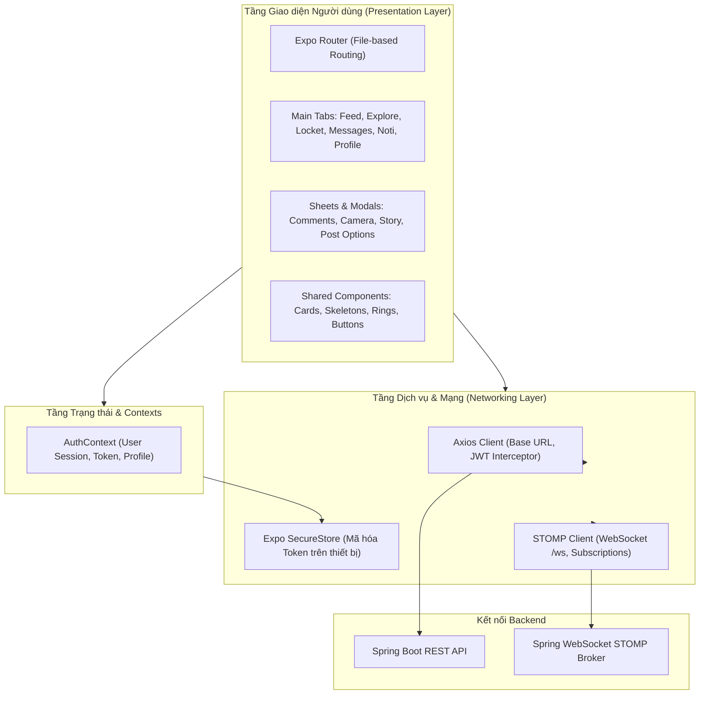

# TÀI LIỆU TOÀN TẬP KIẾN TRÚC & HỆ THỐNG FRONTEND VIBENET

> **Phiên bản**: 1.0  
> **Công nghệ cốt lõi**: React Native 0.81.5, Expo SDK 54, Expo Router 6.0, TypeScript, React Native Reanimated 4, STOMP.js, Axios.  
> **Mục tiêu**: Cung cấp toàn bộ kiến thức, cấu trúc thư mục, luồng hoạt động giao diện, tích hợp WebSocket và bảng tra cứu thư viện của ứng dụng di động VibeNet.

---

## MỤC LỤC

1. [Tổng quan Kiến trúc Hệ thống Frontend](#1-tổng-quan-kiến-trúc-hệ-thống-frontend)
2. [Chi tiết Folder Navigation Tab (`src/app/(tabs)/`)](#2-chi-tiết-folder-navigation-tab-srcapptabs)
3. [Kiến trúc Dịch vụ WebSocket & Real-time (`websocket.ts`)](#3-kiến-trúc-dịch-vụ-websocket--real-time-websocketts)
4. [Đánh giá Hiện trạng Triển khai & Các tính năng Chưa hoàn thiện](#4-đánh-giá-hiện-trạng-triển-khai--các-tính-năng-chưa-hoàn-thiện)
5. [Bảng tra cứu toàn bộ Thư viện Frontend (`package.json`)](#5-bảng-tra-cứu-toàn-bộ-thư-viện-frontend-packagejson)

---

## 1. Tổng quan Kiến trúc Hệ thống Frontend

Ứng dụng di động VibeNet được phát triển theo mô hình **Component-Driven & Service-Oriented Architecture**, tận dụng tối đa cơ chế **File-based Routing của Expo Router**:

---

## 2. Chi tiết Folder Navigation Tab (`src/app/(tabs)/`)

Thư mục `vibenet/src/app/(tabs)` quản lý toàn bộ các màn hình chính của ứng dụng thông qua thanh điều hướng đáy.

### 2.1 [`_layout.tsx`](file:///c:/vibenet/vibenet/src/app/(tabs)/_layout.tsx) — Bộ khung điều hướng
* **Cấu hình Layout**:
  * Ẩn thanh tab bar mặc định (`tabBarStyle: { display: 'none' }`).
  * Sử dụng component thanh điều hướng nổi dạng kính mờ: `<FloatingTabBar />`.
  * Khai báo 6 màn hình tab: `index` (Feed), `explore` (Explore), `locket` (Locket), `messages` (Messages), `notifications` (Notifications), `profile` (Profile).
  * Hiệu ứng chuyển màn hình fade mượt mà.

---

### 2.2 [`index.tsx`](file:///c:/vibenet/vibenet/src/app/(tabs)/index.tsx) — Bảng tin Feed & Video Reels
Tích hợp **2 chế độ xem** chính:
1. **Chế độ Photo Feed (`homeTab: 'feed'`)**:
   * **`StoryHighlightBar`**: Hiển thị avatar tròn viền gradient động chứa story 24h của bạn bè và nút dấu `+` để thêm story mới.
   * **`PostCard`**: Thẻ bài viết chứa media ảnh/video/text gradient, họ tên tác giả, thời gian đăng, nút thả tim, nút mở bình luận và nút tùy chọn.
   * **Các Modal tương tác**:
     * `CommentsSheetModal`: Bảng trượt Bottom Sheet xem và gửi bình luận bài viết.
     * `CreatePostModal`: Đăng bài viết mới hoặc tạo story.
     * `StoryViewerModal`: Xem story toàn màn hình có thanh tiến trình tự chuyển tiếp.
     * `PostOptionsModal` & `EditCaptionModal`: Quản lý lưu, xoá bài hoặc sửa chú thích.
2. **Chế độ Reels (`homeTab: 'reels'`)**:
   * Sử dụng `ReelsFeedView` tự động lọc các bài viết có định dạng video (`.mp4, .mov,...`) và hiển thị video toàn màn hình dạng cuộn dọc snapping từng video (TikTok / Instagram Reels style).

---

### 2.3 [`explore.tsx`](file:///c:/vibenet/vibenet/src/app/(tabs)/explore.tsx) — Khám phá & Tìm kiếm
* **Tìm kiếm Người dùng (Search Mode)**:
  * Ô nhập liệu có cơ chế **Debounce 300ms** gọi API `usersApi.searchUsers(query)`.
  * Tự động hiển thị danh sách kết quả gồm Avatar, Họ tên, `@username`, click vào sẽ điều hướng đến Profile của người đó.
* **Lưới khám phá (Masonry Grid)**:
  * Khi không tìm kiếm, hiển thị thanh phân loại danh mục: `All`, `Photography`, `Architecture`, `Nature`, `Art`.
  * Hiển thị lưới so le 2 cột (`ExploreGridCard`) gồm ảnh và reel nổi bật kèm số lượt tim và biểu tượng video.

---

### 2.4 [`locket.tsx`](file:///c:/vibenet/vibenet/src/app/(tabs)/locket.tsx) — Khoảnh khắc Locket Widget
* **Khung ngắm trung tâm (Viewfinder Card)**:
  * Sử dụng `FlatList` snap từng ảnh/video theo tỉ lệ chuẩn `MomentAspectRatio`.
  * Hiển thị Avatar, tên người gửi, thời gian đăng, nút xoá (nếu là ảnh của mình) và caption trên ảnh.
* **Thanh chụp đáy (Bottom Capture Bar)**:
  * Nút lưới bên trái: Mở `MyMomentsModal` xem kho lưu trữ tất cả moment đã đăng.
  * Nút chụp tròn ở giữa (Shutter): Mở camera trực tiếp (`CameraCaptureModal`) chụp và gửi ngay.
  * Nút ảnh bên phải: Chọn ảnh từ thư viện điện thoại (`expo-image-picker`) và upload thành moment.

---

### 2.5 [`messages.tsx`](file:///c:/vibenet/vibenet/src/app/(tabs)/messages.tsx) — Hộp thư Chat & Trạng thái Online
* **Hàng bạn bè Online (ONLINE NOW)**:
  * `ScrollView` ngang hiển thị avatar tròn và chấm xanh `onlineDot` của những bạn bè đang hoạt động (`getOnlineUsers()`), click vào mở phòng chat ngay.
* **Danh sách cuộc trò chuyện (DIRECT MESSAGES)**:
  * Hiển thị avatar bạn bè, tên, trích đoạn tin nhắn gần nhất (`lastMessage`) và thời gian gửi.
* **Live WebSocket Reordering**:
  * Lắng nghe sự kiện `onChatMessage` từ WebSocket STOMP. Khi có tin nhắn mới, phòng chat tương ứng tự động cập nhật preview và nhảy lên đầu danh sách (move to top) ngay lập tức.

---

### 2.6 [`notifications.tsx`](file:///c:/vibenet/vibenet/src/app/(tabs)/notifications.tsx) — Trung tâm Thông báo
* **Mục Lời mời kết bạn (Friend Requests)**:
  * Hiển thị số lượng lời mời đang chờ duyệt, bấm vào dẫn tới trang `/friend-requests`.
* **Danh sách thông báo**:
  * Phân loại nội dung theo `NotificationType`: `FRIEND_REQUEST`, `REACTION`, `COMMENT`, `MOMENT_REPLY`, `LOCKET_MOMENT_RECEIVED`, `FOLLOW`,...
  * Với lời mời kết bạn: Có sẵn 2 nút **Accept** và **Decline** để duyệt nhanh ngay trên dòng thông báo.
  * Tự động gọi `markAllNotificationsRead()` khi người dùng mở tab.

---

### 2.7 [`profile.tsx`](file:///c:/vibenet/vibenet/src/app/(tabs)/profile.tsx) — Trang cá nhân của User
* **Header Profile**: Ảnh bìa (Cover Banner), Avatar có viền Story (`AvatarStoryRing`), Họ tên, Bio và hàng thống kê số lượng **Posts** và **Friends**.
* **Bộ chuyển đổi 4 Tab con mượt mà (Spring Gliding Tabs)**:
  * Sử dụng thư viện `react-native-reanimated` với `useSharedValue` và `withTiming` để tạo thanh gạch chân trượt mượt:
    1. `posts`: Lưới ảnh các bài viết của chính user.
    2. `liked`: Các bài viết user đã bấm thả tim.
    3. `saved`: Các bài viết user đã lưu (Bookmark).
    4. `friends`: Danh sách bạn bè kèm nút **Message** để mở chat 1-1 ngay.
* **Đăng xuất an toàn**: Nút logout kích hoạt `ConfirmModal` xác nhận trước khi xóa token và đưa về màn hình Login.

---

## 3. Kiến trúc Dịch vụ WebSocket & Real-time (`websocket.ts`)

File [`src/services/websocket.ts`](file:///c:/vibenet/vibenet/src/services/websocket.ts) đóng gói toàn bộ logic STOMP Client:

1. **Khởi tạo kết nối & Xác thực**:
   * Dùng thư viện `@stomp/stompjs`.
   * Trong hook `beforeConnect`, lấy JWT Token từ `getAccessToken()` và gán vào header `Authorization: Bearer <token>`.
   * Tự động reconnect sau 3 giây nếu mất kết nối mạng.
2. **Quản lý Subscriptions tập trung**:
   * `/user/queue/messages`: Đăng ký nhận tin nhắn chat gửi đến user.
   * `/topic/chat/{chatId}/typing`: Lắng nghe trạng thái bạn bè đang soạn tin nhắn (`TypingEvent`).
   * `/topic/chat/{chatId}/read`: Lắng nghe trạng thái bạn bè đã đọc tin nhắn (`ReadEvent`).
   * `/topic/posts/{postId}/reactions` & `comments`: Lắng nghe reaction/comment bài viết.
3. **Các hàm tiện ích xuất ra**:
   * `sendChatMessage(recipientId, content)`: Gửi tin nhắn chat lên `/app/chat.send`.
   * `sendTyping(chatId, isTyping)`: Báo trạng thái gõ lên `/app/chat.typing`.
   * `sendRead(chatId, lastMessageId)`: Báo trạng thái đã đọc lên `/app/chat.read`.

---

## 4. Đánh giá Hiện trạng Triển khai & Các tính năng Chưa hoàn thiện

Qua kết quả quét toàn bộ mã nguồn Frontend đối chiếu với Backend:

| Tính năng | Trạng thái | Chi tiết triển khai |
| :--- | :---: | :--- |
| **Typing Indicator** | ✅ Đã hoàn thiện | Đã tích hợp cả ở `websocket.ts` và màn hình `app/chat/[id].tsx` (Header hiển thị `"Typing…"`, danh sách hiện bubble 3 chấm `…`). |
| **Seen / Read Receipt** | ✅ Đã hoàn thiện | Đã tích hợp cả ở `websocket.ts` và `app/chat/[id].tsx` (Hiển thị nhãn `"Seen"` ở tin nhắn cuối khi đối phương đọc). |
| **Chat Nhóm (Group Chat)** | ❌ Chưa có | Cả Backend và Frontend đều chưa có entity, API và giao diện cho Group Chat. |
| **Real-time Notifications via WS** | ⚠️ Cần bổ sung | Backend có `/user/queue/notifications` nhưng Frontend chưa subscribe trong `websocket.ts` (hiện dùng REST API pull). |
| **Persistent Read Receipts** | ⚠️ Cần nâng cấp | Trạng thái Seen hiện là *Ephemeral Event* (chưa lưu vào DB nên khi thoát app sẽ mất trạng thái seen cũ). |
| **Typing/Seen ngoài Inbox (`messages.tsx`)** | ⚠️ Cần bổ sung | Màn hình danh sách inbox chưa hiển thị "Bạn bè đang soạn tin..." ngay ngoài danh sách. |
| **Voice & Video Call** | ⚪ Mockup UI | Nút gọi thoại và video trên header chat hiện là nút tĩnh, chưa tích hợp WebRTC SDK. |

---

## 5. Bảng tra cứu toàn bộ Thư viện Frontend (`package.json`)

| Tên Thư viện | Phiên bản | Nhóm chức năng & Công dụng chi tiết |
| :--- | :--- | :--- |
| **`react` & `react-native`** | 19.1.0 / 0.81.5 | Khung nền tảng ứng dụng di động React Native phiên bản mới nhất. |
| **`expo`** | 54.0.37 | Bộ công cụ và SDK quản lý vòng đời ứng dụng, build và tích hợp Native Modules. |
| **`expo-router`** | 6.0.24 | Điều hướng theo cơ chế File-based Routing (tự động ánh xạ file trong `app/` thành màn hình). |
| **`@stomp/stompjs`** | 7.3.0 | Thư viện kết nối WebSocket STOMP phục vụ Chat, Typing, Seen và Real-time events. |
| **`axios`** | 1.19.0 | HTTP Client gọi REST API, tự động đính kèm JWT Bearer Token qua Interceptor. |
| **`react-native-reanimated`** | 4.1.1 | Thư viện Animation chạy mượt mà trên UI Thread (60–120 FPS), dùng cho thanh trượt tab profile. |
| **`react-native-gesture-handler`**| 2.28.0 | Xử lý các thao tác vuốt, chạm, kéo ở tầng Native. |
| **`@gorhom/bottom-sheet`** | 5.2.14 | Bảng trượt Bottom Sheet mở khung bình luận (`CommentsSheetModal`) và tùy chọn bài viết. |
| **`expo-image`** | 3.0.11 | Component hiển thị hình ảnh hiệu năng cao, tự động cache đĩa/RAM và hỗ trợ blurhash. |
| **`expo-camera`** | 17.0.10 | Mở camera trực tiếp trong app để chụp ảnh/quay video Locket Moments. |
| **`expo-image-picker`** | 17.0.11 | Mở thư viện ảnh của thiết bị để chọn ảnh đăng bài, đăng moment, đổi avatar. |
| **`expo-image-manipulator`** | 14.0.8 | Cắt (crop), xoay, nén và resize ảnh trước khi upload để giảm dung lượng mạng. |
| **`expo-video`** | 3.0.16 | Phát video cho tính năng Reels cuộn dọc toàn màn hình và video trong bài viết. |
| **`expo-blur` & `expo-glass-effect`**| 15.0.8 / 0.1.10 | Tạo hiệu ứng kính mờ (Glassmorphism) cho thanh điều hướng nổi `FloatingTabBar`. |
| **`expo-linear-gradient`** | 15.0.8 | Vẽ dải màu gradient chuyển sắc cho viền Story và nền bài viết text. |
| **`expo-haptics`** | 15.0.8 | Tạo phản hồi rung xúc giác vật lý (Haptic Feedback) khi tương tác like, chuyển tab. |
| **`expo-secure-store`** | 15.0.8 | Lưu trữ mã hóa an toàn JWT Access/Refresh Token trong iOS Keychain / Android KeyStore. |
| **`lottie-react-native`** | 7.3.4 | Render các hoạt ảnh vector Lottie JSON siêu nhẹ (loading, thả tim). |
| **`@expo/vector-icons` & `expo-symbols`**| 15.0.2 / 1.0.8 | Bộ sưu tập icon phong phú (Ionicons, Feather, MaterialIcons, SF Symbols). |
| **`react-native-safe-area-context`**| 5.6.0 | Căn chỉnh khoảng cách an toàn, tránh tai thỏ (Notch) và thanh điều hướng đáy. |
| **`react-native-screens`** | 4.16.0 | Tối ưu bộ nhớ bằng cách sử dụng Native View Controller của iOS/Android khi chuyển trang. |
| **`react-native-svg`** | 15.12.1 | Render các hình vẽ vector SVG (logo, icon tùy biến `VibenetMark`). |
| **`expo-splash-screen` & `expo-status-bar`**| 31.0.13 / 3.0.9 | Quản lý màn hình khởi động app và thanh trạng thái pin/sóng. |
| **`expo-linking` & `expo-web-browser`**| 8.0.12 / 15.0.11 | Xử lý Deep Linking và mở trình duyệt in-app. |
| **`react-native-web`** | 0.21.0 | Cho phép chạy toàn bộ ứng dụng trên nền tảng Web. |
